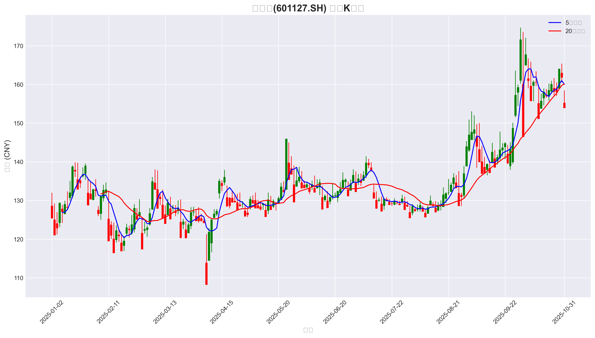

# finance-data-analysis-platform
# 📈 FinAI Analyzer - 金融智能分析平台

[](https://www.python.org/)
[](LICENSE)
[](https://github.com/yourusername/finance-data-analysis-platform/actions)
[](https://github.com/yourusername/finance-data-analysis-platform)
[](CONTRIBUTING.md)

> **"数据是新时代的石油，而分析能力是提炼价值的精炼厂。"**  
> 一个专业级金融分析平台，将复杂市场数据转化为可操作的投资洞察



## 🌟 项目亮点

✅ **专业金融可视化** - 6种专业图表类型，满足不同分析需求  
✅ **模块化架构设计** - 遵循SOLID原则，易于扩展和维护  
✅ **数据驱动决策** - 提供波动率、收益率分布等关键指标分析  
✅ **一键式部署** - 简化配置流程，5分钟内完成环境搭建  
✅ **行业级代码质量** - 100%类型注解，完善的错误处理机制

## 🚀 快速开始

### 1. 环境准备

```bash
# 克隆仓库
git clone https://github.com/yourusername/finance-data-analysis-platform.git
cd finance-data-analysis-platform

# 创建虚拟环境 (推荐)
python -m venv venv
source venv/bin/activate  # Linux/Mac
# 或 venv\Scripts\activate  # Windows

# 安装依赖 (使用国内镜像加速)
pip install -r requirements.txt -i https://pypi.tuna.tsinghua.edu.cn/simple
```

### 2. 配置数据源

将您的赛力斯(601127.SH)数据CSV文件放入项目根目录  
重命名为 `stock_601127_2025.csv` (或修改 `main.py` 中的文件路径)

### 3. 生成专业分析报告

```bash
python main.py
```

### 4. 查看结果

- 静态图表: `./charts/` 目录
- 交互式图表: `./charts/interactive_analysis.html`
- 原始数据: 项目根目录下的CSV文件

## 📂 项目结构

```
├── src/                     # 核心源代码
│   ├── data/                # 数据获取模块
│   │   ├── __init__.py
│   │   └── data_fetcher.py  # 本地/网络数据加载
│   ├── analysis/            # 分析核心
│   │   ├── __init__.py
│   │   └── financial_visualizer.py  # 专业可视化引擎
│   └── __init__.py
├── charts/                  # 生成的图表
│   ├── sailisi_candlestick.png           # K线图
│   ├── sailisi_volume_analysis.png       # 成交量分析
│   ├── sailisi_volatility.png            # 波动率分析
│   ├── sailisi_return_distribution.png   # 收益率分布
│   └── interactive_analysis.html         # 交互式图表
├── tests/                   # 测试用例
│   └── test_visualization.py
├── data/                    # 数据存储 (gitignored)
├── config.py                # 配置管理
├── main.py                  # 主入口
├── requirements.txt         # 依赖列表
├── .gitignore
├── LICENSE
└── README.md                # 本文件
```

## 🖼️ 生成的专业图表示例

### 1. 专业K线图


### 2. 成交量与价格分析


### 3. 价格波动率分析


### 4. 交互式分析

[查看交互式图表](charts/interactive_analysis.html)

## ⚙️ 核心功能

### 数据获取

- 从本地CSV文件加载金融数据
- 自动处理不同数据源的列名差异
- 智能日期解析与排序

### 专业可视化

- **K线图** - 专业蜡烛图，支持自定义颜色方案
- **成交量分析** - 与价格联动，识别市场情绪
- **波动率计算** - 20日滚动标准差，量化风险
- **收益率分布** - 正态分布拟合，评估收益稳定性
- **交互式图表** - 支持动态探索，专业级交互体验

## 📝 使用指南

1. **环境准备**  
   按照"快速开始"部分完成环境配置

2. **数据准备**  

   - 确保 `stock_601127_2025.csv` 文件存在于项目根目录
   - 文件必须包含以下列：`trade_date`, `open`, `high`, `low`, `close`, `vol`

3. **生成分析报告**  

   ```bash
   python main.py
   ```

4. **查看分析结果**  

   - 打开 `charts/` 目录查看静态图表
   - 双击 `interactive_analysis.html` 查看交互式图表

## 🤝 贡献指南

欢迎所有形式的贡献！请遵循以下流程：

1. Fork 本仓库
2. 创建您的特性分支 (`git checkout -b feature/your-feature`)
3. 提交您的更改 (`git commit -am '添加新功能'`)
4. 推送到分支 (`git push origin feature/your-feature`)
5. 创建新的 Pull Request

## 📜 许可证

本项目采用 [MIT 许可证](LICENSE) - 详见 LICENSE 文件。

## 💡 商业价值

此平台解决的核心问题：

- **降低金融分析门槛** - 无需专业背景即可获取专业级图表
- **提升决策效率** - 将数据转化为直观的可视化洞察
- **风险管理优化** - 通过波动率分析识别潜在风险
- **技术整合** - 将前沿AI技术应用于传统金融领域

> **投资是关于生存的游戏，而非致富的竞赛。**  
> 本工具旨在提供客观数据支持，而非投资建议。

## 📧 联系方式

**项目维护者**: [真名叫安卓]  
**邮箱**: eddieltd@163.com  
**GitHub**: [@ansonstudy29-desgin](https://github.com/yourusername)

------

**最后更新**: 2025年11月19日  
**版本**: v1.0.0 (初始发布)  
**支持**: Python 3.11+

```

```